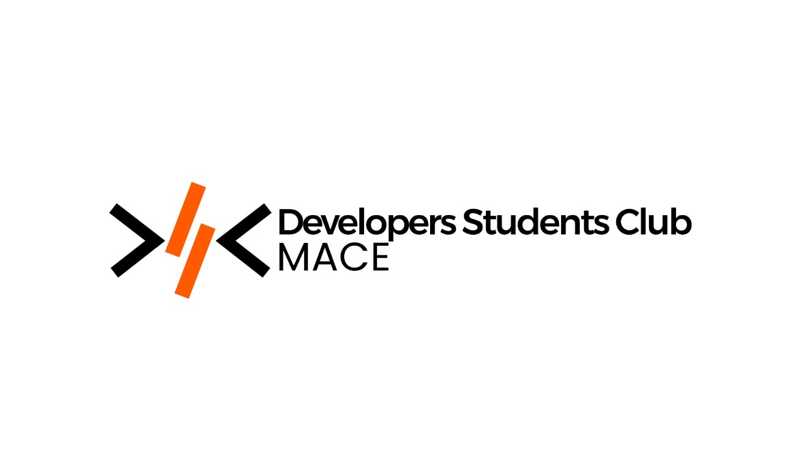

# RAG-DSC 🚀

Welcome to **RAG-DSC**, an initiative by the **Developer Student Club (DSC) of Mar Athanasius College of Engineering (MACE)**. This project is aimed at introducing students to **Retrieval-Augmented Generation (RAG)** and helping them understand its working through hands-on implementation.



## 📌 Project Overview

The project is designed to **familiarize students with RAG-based architectures** by dividing them into specialized teams. Most of the participants are beginners, so the focus is on learning and collaboration.

### 🔹 Teams & Responsibilities

- **📄 PDF Creation Team:** Prepares and organizes documents for processing.
- **📖 Parsing & Vectorization Team:** Handles text extraction and converts it into vector embeddings.
- **🤖 Model Development & Training Team:** Works on fine-tuning models for RAG.
- **🔗 Backend Integration Team:** Ensures seamless model integration into APIs.
- **🖥️ Frontend Integration Team:** Develops the UI for user interaction.

## 🏗️ Workspace Structure

The workspace is organized as follows:

📂 **data/** - Contains dataset files and processed information.  
📂 **docs/** - Documentation and references for the project.  
📂 **src/** - Source code for different components.  
📂 **tests/** - Unit tests and validation scripts.  

*(Refer to the provided workspace structure image for more details.)*

## 🛠️ Getting Started

Follow these steps to get started with the project:

1. Clone the repository:
   ```bash
   git clone https://github.com/Codesandmore/RAG-DSC.git
   ```
2. Navigate to the project directory:
   ```bash
   cd RAG-DSC
   ```
3. Install dependencies (if any):
   ```bash
   pip install -r requirements.txt
   ```
4. Start contributing! 🚀

## 📢 Contribution Guidelines

### 🔧 How to Contribute

1. **Create a new branch** for your work:
   ```bash
   git checkout -b feature-branch-name
   ```
2. **Make your changes** in the appropriate files.
3. **Stage and commit your changes:**
   ```bash
   git add .
   git commit -m "Describe your changes here"
   ```
4. **Push your changes** to the repository:
   ```bash
   git push origin feature-branch-name
   ```
5. **Create a pull request (PR):**
   - Go to the GitHub repository.
   - Navigate to the "Pull Requests" tab.
   - Click on "New Pull Request."
   - Select your branch and compare it with the main branch.
   - Submit the pull request for review.

### ✅ Best Practices

- Follow proper coding standards.
- Write meaningful commit messages.
- Keep PRs small and focused.
- Collaborate and help fellow team members.
- Document your work to improve maintainability.

## 🔥 Join the Learning Experience!

This project is a stepping stone for students to explore **RAG** and contribute to an exciting real-world application. Happy coding! 😃

